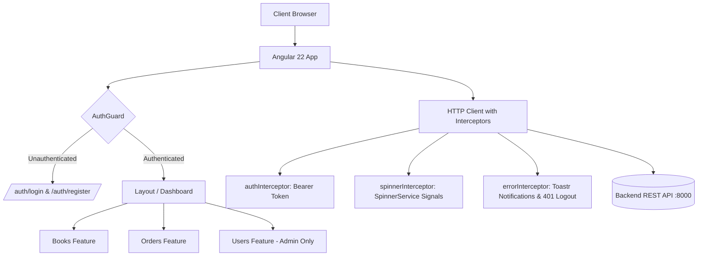

# 📚 Angular Book Catalog & Order Service

[](https://angular.dev/)
[](https://www.typescriptlang.org/)
[](https://tailwindcss.com/)
[](https://material.angular.dev/)
[](https://vitest.dev/)
[](LICENSE)

An enterprise-grade, modern **Book Catalog & Order Management System** built with **Angular 22**, standalone architecture, Angular Signals for fine-grained reactivity, Angular Material 3 design tokens, Tailwind CSS 4, and robust Role-Based Access Control (RBAC).

---

## 📑 Table of Contents

- [Overview](#-overview)
- [Key Features](#-key-features)
  - [Authentication & RBAC](#1-authentication--role-based-access-control-rbac)
  - [Book Catalog Management](#2-book-catalog-management)
  - [Order Processing Service](#3-order-processing-service)
  - [User Administration](#4-user-administration-admin-only)
  - [Core Infrastructure & Shared Systems](#5-core-infrastructure--shared-systems)
- [Architecture & Folder Structure](#-architecture--folder-structure)
- [System Flow & Architecture Diagram](#-system-flow--architecture-diagram)
- [Tech Stack](#-tech-stack)
- [API Endpoints Reference](#-api-endpoints-reference)
- [Getting Started](#-getting-started)
  - [Prerequisites](#prerequisites)
  - [Installation](#installation)
  - [Development Server](#development-server)
  - [Building for Production](#building-for-production)
  - [Running Unit Tests](#running-unit-tests)
- [Security & Route Guards](#-security--route-guards)
- [Styling & Design System](#-styling--design-system)
- [Contributing & License](#-contributing--license)

---

## 🌟 Overview

The **Angular Book Catalog & Order Service** provides a seamless interface for customers and administrators to browse books, place and manage multi-item orders, update stock inventories, and administer system users. Built from the ground up using Angular's next-generation paradigms (Standalone Components, Signals, `input()` / `output()` APIs, Functional Interceptors, and Control Flow syntax `@if` / `@for`), the application delivers blazing-fast performance and clean architectural separation.

---

## 🚀 Key Features

### 1. Authentication & Role-Based Access Control (RBAC)

- **User Registration (`/auth/register`)**:
  - Full client-side validation for Firstname, Lastname, Username, Email, Password, and Password Confirmation.
  - Regex pattern matching for valid names and usernames.
  - Custom password-matching validator (`passwordsMatchValidator`).
  - Automatically creates accounts with the `CUSTOMER` role.
- **User Login (`/auth/login`)**:
  - Form validation with interactive password show/hide toggle.
  - JWT storage via centralized `StorageService`.
  - Smart redirection preserving user return paths (`returnUrl`).
- **Role Permissions**:
  - **`ADMIN`**: Full access to book catalog creation/editing, user list inspection, order overview, and cancellation.
  - **`CUSTOMER`**: Access to book catalog browsing, order placement with dynamic stock checking, and viewing/canceling own orders.

---

### 2. Book Catalog Management

- **Interactive Catalog View (`/dashboard/books`)**:
  - Displays Title, ISBN, Author, formatted Price, Available Quantity, and Creation Date.
  - Debounced real-time search filtering (400ms debounce).
- **Book Details Modal (`ViewBook`)**:
  - Rich dialog presentation displaying metadata, publisher/creator information, ISBN chips, and availability status.
- **Create & Edit Books (`AddEditBook`)**:
  - **Create Mode**: Admin can register new books with full validation (Title, ISBN, Author, Price, Quantity).
  - **Edit Mode**: Allows updating pricing and stock levels while locking immutable fields (Title, ISBN, Author) to preserve catalog consistency.

---

### 3. Order Processing Service

- **Dynamic Order Creation Dialog (`PlaceOrder`)**:
  - Reactive `FormArray` supporting addition/removal of multiple book items in a single transaction.
  - **Live Inventory Validation**: Automatically prevents selecting quantities exceeding current stock with custom validator (`quantityValidator`).
  - Real-time subtotal and order grand-total calculations as items and quantities change.
- **Order Monitoring (`/dashboard/orders`)**:
  - Track order ID, placing customer name, item count, total price, creation date, and lifecycle status (`PENDING`, `COMPLETED`, `CANCELLED`).
  - Search/filter orders by status.
- **Order Details Modal (`ViewOrder`)**:
  - Itemized receipt showing each book's unit price, quantity ordered, and line item subtotal.
- **Order Cancellation**:
  - Customers can cancel their own orders directly from the actions menu if the status is not already `CANCELLED`.

---

### 4. User Administration (Admin Only)

- **User Directory (`/dashboard/users`)**:
  - Route guarded by `AuthGuard` with `UserRoleEnum.ADMIN` verification.
  - View all registered users, usernames, system roles, and registration dates.
  - Search across Firstname, Lastname, and Username.
- **User Profile Modal (`ViewUser`)**:
  - Displays user avatar initials, full name, role badge, account creation timestamp, and any catalog items added by the user.

---

### 5. Core Infrastructure & Shared Systems

- **Reusable Generic Table (`GenericTable`)**:
  - Highly configurable table powered by Angular Material Table.
  - Supports dynamic columns, custom formatting pipes, date formatters, conditional action buttons, and debounced search input.
- **Functional HTTP Interceptors**:
  - `authInterceptor`: Automatically appends `Authorization: Bearer <token>` to outbound requests.
  - `spinnerInterceptor`: Automatically tracks active HTTP requests and controls the global spinner (skips requests marked with `No-Spinner`).
  - `errorInterceptor`: Catches backend HTTP errors, routes on `401 Unauthorized`, and surfaces errors via Toastr.
- **Global Loading Spinner**:
  - Controlled by signal-based `SpinnerService` tracking asynchronous HTTP request reference counts.
- **Toast Notifications (`ngx-toastr`)**:
  - Standardized success/error feedback utilizing centralized notification constants (`SuccessMessages`).
- **Responsive Layout & Sidebar**:
  - Collapsible desktop/mobile sidebar with active route highlighting, user profile badge, and one-click logout.

---

## 🏗 System Flow & Architecture Diagram



---

## 📁 Architecture & Folder Structure

```text
src/
├── app/
│   ├── app.config.ts                   # Application configuration, providers, interceptors, toastr
│   ├── app.routes.ts                   # Root routing configuration (lazy-loaded modules)
│   ├── app.ts                          # Root component with global LoadingSpinner & RouterOutlet
│   │
│   ├── core/                           # Singleton services, interceptors, constants, API URLs
│   │   ├── api/
│   │   │   └── api-urls.ts             # Centralized API endpoint routes
│   │   ├── constants/
│   │   │   └── successMessages.ts      # Standardized UI feedback messages
│   │   ├── interceptors/
│   │   │   ├── auth.interceptor.ts     # JWT Authorization header injector
│   │   │   ├── error.interceptor.ts    # Global HTTP error handler & redirector
│   │   │   └── spinner.interceptor.ts  # HTTP-aware global loading indicator
│   │   └── services/
│   │       ├── auth.guard.service.ts   # Route guard (Guest, Auth, and RBAC)
│   │       ├── auth.service.ts         # Login, Register, Token, and Role helpers
│   │       ├── books.service.ts        # Books HTTP CRUD operations
│   │       ├── orders.service.ts       # Order placement, cancellation, and retrieval
│   │       ├── users.service.ts        # User administration APIs
│   │       ├── storage.service.ts      # Local/Session storage wrapper
│   │       ├── spinner.service.ts      # Angular Signal request-count manager
│   │       └── notification.service.ts # Toastr notification helper
│   │
│   ├── features/                       # Business domain modules
│   │   ├── auth/                       # Authentication feature
│   │   │   ├── auth.routes.ts          # Auth feature routing
│   │   │   ├── components/
│   │   │   │   ├── login/              # Login form component
│   │   │   │   └── signup/             # Signup registration form
│   │   │   └── interfaces/             # Auth DTOs & Interfaces
│   │   ├── books/                      # Book catalog feature
│   │   │   ├── components/
│   │   │   │   ├── books.ts            # Book list with search & actions
│   │   │   │   ├── add-edit-book/      # Book creation and editing dialog
│   │   │   │   └── view-book/          # Book details display dialog
│   │   │   └── interfaces/             # Book DTOs (IBookRequest, IBookResponse)
│   │   ├── orders/                     # Order management feature
│   │   │   ├── components/
│   │   │   │   ├── orders.ts           # Order history & status list
│   │   │   │   ├── place-order/        # Dynamic multi-item order placement dialog
│   │   │   │   └── view-order/         # Order receipt & items modal
│   │   │   └── interfaces/             # Order DTOs (IOrderRequest, IOrderResponse)
│   │   └── users/                      # User administration feature
│   │       ├── components/
│   │       │   ├── users.ts            # Users list with search
│   │       │   └── view-user/          # User profile view modal
│   │       └── interfaces/             # User DTOs (IUserResponse)
│   │
│   ├── layout/                         # Application layout structure
│   │   ├── dashboard/                  # Dashboard child routes container
│   │   ├── sidebar/                    # Collapsible dynamic navigation bar
│   │   ├── layout.ts                   # Main layout container
│   │   └── layout.routes.ts            # Layout routing with AuthGuard
│   │
│   └── shared/                         # Reusable UI components, enums, interfaces
│       ├── components/
│       │   ├── generic-table/          # Generic search-enabled Angular Material Table
│       │   └── loading-spinner/        # Overlay loading spinner component
│       ├── enums/
│       │   ├── OrderStatusEnum.ts      # PENDING | COMPLETED | CANCELLED
│       │   └── UserRoleEnum.ts         # ADMIN | CUSTOMER
│       └── interfaces/
│           └── table-configuration.ts  # Generic table column & action contracts
│
├── styles.scss                         # Material Theme definitions & global styles
├── tailwind.css                        # Tailwind CSS v4 design tokens and directives
└── main.ts                             # Application bootstrap
```

---

## 🛠 Tech Stack

| Category               | Technology                                             | Description                                                            |
| :--------------------- | :----------------------------------------------------- | :--------------------------------------------------------------------- |
| **Framework**          | [Angular 22](https://angular.dev/)                     | Standalone components, modern Signals, `@if`/`@for` control flow       |
| **Language**           | [TypeScript 6](https://www.typescriptlang.org/)        | Strongly typed models, interfaces, and strict type safety              |
| **UI Components**      | [Angular Material 22](https://material.angular.dev/)   | Dialogs, Tables, Inputs, Buttons, Form Fields, Menus, Chips            |
| **Styling**            | [Tailwind CSS 4](https://tailwindcss.com/) & SCSS      | PostCSS integration with custom `@theme` color tokens & typography     |
| **Icons**              | [Bootstrap Icons](https://icons.getbootstrap.com/)     | Modern vector icons                                                    |
| **Asynchronous State** | [RxJS 7](https://rxjs.dev/) & Signals                  | Hybrid reactive pipelines (`signal`, `computed`, `takeUntilDestroyed`) |
| **Notifications**      | [ngx-toastr](https://www.npmjs.com/package/ngx-toastr) | Toast popups with custom animations and progress bars                  |
| **Unit Testing**       | [Vitest 4](https://vitest.dev/) & JSDOM                | Fast, next-generation unit test runner                                 |

---

## 🔌 API Endpoints Reference

The frontend communicates with a backend REST service configured via [`api-urls.ts`](file:///src/app/core/api/api-urls.ts) (Default: `http://localhost:8000/api/`):

| Domain     | Method  | Endpoint                | Description                              | Protected |      Role       |
| :--------- | :------ | :---------------------- | :--------------------------------------- | :-------: | :-------------: |
| **Auth**   | `POST`  | `/api/auth/login`       | Authenticate user & return JWT + profile |    No     |      Guest      |
| **Auth**   | `POST`  | `/api/auth/register`    | Register new customer account            |    No     |      Guest      |
| **Books**  | `GET`   | `/api/book`             | Fetch all books in catalog               |    Yes    |       Any       |
| **Books**  | `POST`  | `/api/book`             | Create a new book in catalog             |    Yes    |     `ADMIN`     |
| **Books**  | `PATCH` | `/api/book/:id`         | Update price and quantity of a book      |    Yes    |     `ADMIN`     |
| **Orders** | `GET`   | `/api/order`            | Retrieve all orders                      |    Yes    |       Any       |
| **Orders** | `POST`  | `/api/order`            | Place new order with item array          |    Yes    |       Any       |
| **Orders** | `PATCH` | `/api/order/:id/cancel` | Cancel an active order                   |    Yes    | Owner / `ADMIN` |
| **Users**  | `GET`   | `/api/user`             | Fetch list of registered users           |    Yes    |     `ADMIN`     |

---

## 💻 Getting Started

### Prerequisites

Make sure you have the following installed on your environment:

- **Node.js**: `v20.x` or `v22.x` (LTS recommended)
- **NPM**: `v10.x` or higher
- **Angular CLI** (optional global install):
  ```bash
  npm install -g @angular/cli@22
  ```

### Installation

1. **Clone the repository**:

   ```bash
   git clone https://github.com/momen882001/Angular_BookCatalogOrderService.git
   cd Angular_BookCatalogOrderService
   ```

2. **Install project dependencies**:
   ```bash
   npm install
   ```

### Development Server

Run the development server locally:

```bash
npm start
# or
ng serve
```

Navigate to `http://localhost:4200/` in your browser. The application will automatically reload if you change any source files.

> [!NOTE]
> Ensure your backend REST API is running on `http://localhost:8000` or update `apiBaseUrl` in `src/app/core/api/api-urls.ts`.

### Building for Production

Compile the application with production optimizations:

```bash
npm run build
```

Build artifacts will be stored in the `dist/` directory, ready for deployment to any static host (Nginx, AWS S3, Firebase Hosting, Vercel, Netlify).

### Running Unit Tests

Execute unit tests via **Vitest**:

```bash
npm test
```

---

## 🛡 Security & Route Guards

The application utilizes [`AuthGuard`](file:///src/app/core/services/auth.guard.service.ts) to enforce navigation security:

1. **Guest-Only Routes** (`guestOnly: true`):
   - Access to `/auth/login` and `/auth/register` is restricted for authenticated users, automatically redirecting them to `/dashboard`.
2. **Authenticated Routes**:
   - Unauthenticated requests are redirected to `/auth/login` while preserving the intended target URL in `queryParams.returnUrl`.
3. **Role Authorization** (`data: { roles: [UserRoleEnum.ADMIN] }`):
   - Validates user role stored in session. If the user does not have permission (e.g., a customer trying to access `/dashboard/users`), they are routed to `/unauthorized` or redirected away.

---

## 🎨 Styling & Design System

- **Color Tokens**: Standardized custom CSS variables in `styles.scss` mapped to Material 3 sys-tokens (`--app-primary`, `--app-surface`, `--app-accent-warm`).
- **Typography**: Dual-font typography hierarchy combining editorial serif (`Fraunces`) for headers and clean sans-serif (`DM Sans`) for body copy and data tables.
- **Tailwind CSS 4**: Modern CSS theme integration located in `src/tailwind.css` utilizing the `@theme` directive.
- **Micro-animations**: Smooth transitions, table row hover highlights, and custom sleek scrollbars.

---

## 👤 Author

**Mo'men Mohamed** — Frontend service built as part of an internship project (Hypercell Internship 2026).
